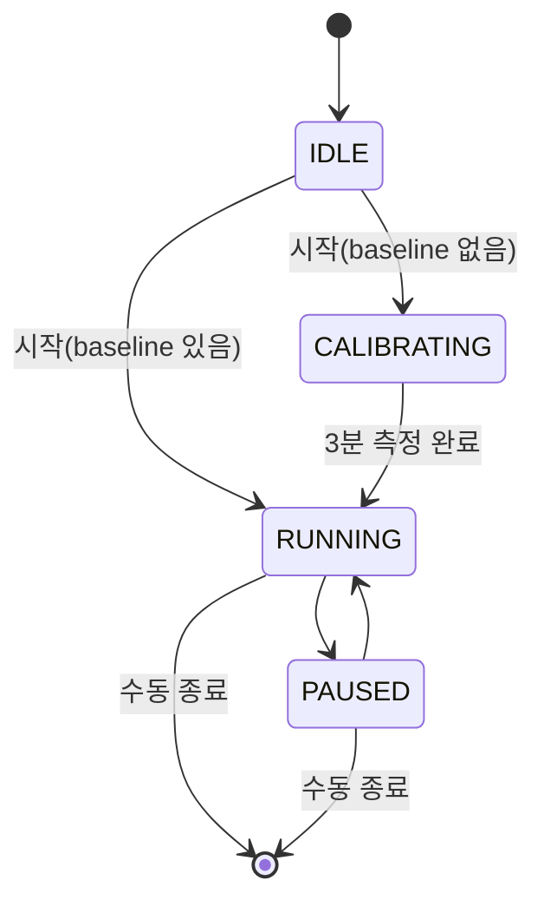
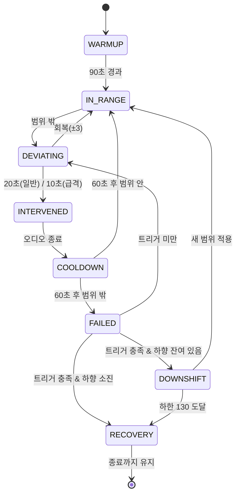

# ENGINE.md — 판정 룰 · 상태머신 · 수치표

**소유: 고은우 (Core FE)** · 구현: `app/src/engine/` (순수 TS, `react-native` import 금지)
이 문서의 숫자가 단일 진실. AI에 엔진 코드 요청 시 §1을 그대로 붙여넣을 것.

## 1. 수치표
| 항목 | 값 | 상수 |
| --- | --- | --- |
| 슬라이딩 윈도우 | 20초 | `WINDOW_SEC` |
| 계산 tick | 5초 | `TICK_SEC` |
| 센서 타이머 | 1초 | `SENSOR_TICK_SEC` |
| samples 저장 | 5초 | `SAMPLE_INTERVAL_SEC` |
| 워밍업 무개입 | **90초** | `WARMUP_SEC` |
| `TOO_SLOW` 판정 시작 | **5분(300초) 이후** | `SLOW_JUDGE_START_SEC` |
| 정지 판정 제외 | **< 50 spm** | `IDLE_CADENCE_THRESHOLD` |
| 걷기 구간 | **50 ~ 120 spm** | `WALK_CADENCE_MIN/MAX` |
| 목표 범위 | 중심 ±4 | `TARGET_HALF_WIDTH` |
| 절대 클램프 | **130 ~ 185** (중심값 기준) | `CADENCE_CLAMP_MIN/MAX` |
| 컨디션 보정 | 가벼움 +2 / 보통 0 / 피곤함 −3 | `CONDITION_ADJUST` |
| 일반 이탈 | 범위 밖 20초 지속 | `DEVIATION_SEC` |
| 급격 이탈 | ±10 초과 밖 10초 지속 | `SEVERE_DEVIATION_SEC` / `SEVERE_THRESHOLD` |
| 회복 | 중심 ±3 진입 | `RECOVERY_HALF_WIDTH` |
| 쿨다운 | 60초 | `COOLDOWN_SEC` |
| 음성 | ≤3초, 1문장 | — |
| 메트로놈 | 5초 | `METRONOME_SEC` |
| **`TOO_FAST` 세션 상한** | **2회** | `MAX_FAST_INTERVENTION` |
| **`TOO_FAST` 중지 지점** | **목표 90% 도달 이후** | `FAST_MUTE_PROGRESS` |
| Downshift(일반) | 실패 2회 | `DOWNSHIFT_FAIL_NORMAL` |
| Downshift(급격) | 실패 1회 | `DOWNSHIFT_FAIL_SEVERE` |
| Downshift(걷기) | 60초 지속 → 즉시 | `WALK_SEC` |
| 최대 하향 | 2회 | `MAX_DOWNSHIFT` |
| 하향 쿨타임 | 5분 | `DOWNSHIFT_INTERVAL_SEC` |
| 하향 하한 | **130** | `DOWNSHIFT_FLOOR` |
| 하향 후 안정화 | 새 범위 30초 유지 | `RESTABILIZE_SEC` |
| **리커버리 진입** | **3번째 하향 조건 충족** 또는 **하한 130 도달** | — |

`RECOVERY(±3) < TARGET(±4)` — 경계 깜빡임 방지 히스테리시스. 뒤집지 말 것.

**비대칭 원칙**: `TOO_FAST`는 개입만 하고 downshift 경로가 없다. `TOO_SLOW`·걷기만 downshift로 간다.
근거는 §7.

## 2. Baseline
- 초기 추천: Rule-based (경험 수준 × 목표). **LLM 미사용.**
- 온보딩 수동 조절: ±5 spm 범위, 1 spm 단위.
- 확정: 첫 러닝 워밍업 후 3분 실측 **중앙값**.
- 2회차 이후: `users.baseline_cadence` 사용.
- 로직 반영 입력: 경험 수준·목표만. 신체 정보 제외.
- 러닝 중 수동 조절: 불가.
- **세션 간 업시프트**: 러닝 종료 후 서버가 판정 — `상단(중심~+4) 유지 60% 이상` + `downshift 0회` + `완주`
  → 다음 목표 `+2` 제안. `reports.next_target_min/max`로 전달. **러닝 중 업시프트는 없다.**

### 노출 규칙
| 대상 | 노출 |
| --- | --- |
| baseline 숫자 | **○** — 첫 러닝 리포트("기준 리듬을 찾았어요 — 157"), 리포트 하단, 설정 |
| 러닝 중 화면의 baseline | ✕ |
| 워밍업 구간·타이머 | ✕ (개념 자체를 노출하지 않음) |

평균·권장치와의 비교는 어떤 화면에도 넣지 않는다. 자기 자신과의 비교만 한다.

## 3. Target Range
```
center    = clamp(baseline + conditionAdjust, 130, 185)
targetMin = center - 4
targetMax = center + 4
```
클램프는 center에만 적용 (min/max 각각에 걸면 범위 폭이 찌그러짐).

### 화면에는 범위를 노출하지 않는다
사용자에게는 **중심값 하나**만 보여준다. 메트로놈도 center BPM으로 울린다.

| | 표기 |
| --- | --- |
| 화면·음성 | `오늘의 리듬 157` |
| 내부 판정 | `153 ~ 161` |
| 하향 안내 | `목표를 152로 낮췄어요` |

범위 안/밖은 숫자가 아니라 **현재 리듬 숫자의 색**으로 표현한다.
정확히 157을 맞추는 건 불가능하므로, "틀렸다"는 인상을 주면 안 된다.

DB·API는 `target_cadence_min/max`가 원본. center는 표시 시 `(min+max)/2`로 계산한다 (±4 대칭이라 항상 정수).

## 4. 측정 사이클
```
1초 타이머 : 누적 걸음 차분 → 순간 SPM
20초 윈도우: 중앙값 → 판정용 cadence
5초 tick   : 판정 + samples push
```
- `watchStepCount` 콜백에서는 누적값만 갱신 (호출 빈도 불규칙).
- 워밍업 90초: tick은 돌되 판정 결과 무시, 샘플 저장은 진행.
- 윈도우 cadence `< 50` → **정지**. 판정 제외, 이탈 카운터 유지(리셋하지 않음).
- 윈도우 cadence `50~120` → **걷기**. 이탈 판정 안 함. 단 60초 지속 시 downshift 트리거(§7).
- 윈도우 cadence `> 120` → **러닝**. 정상 판정.

정지 임계값을 50으로 둔 이유: 걷기 케이던스가 100~120이라, 100으로 자르면 걷는 사람이 정지로 잡힌다.

## 5. 판정 타임라인
| 구간 | `TOO_FAST` | `TOO_SLOW` | Downshift |
| --- | --- | --- | --- |
| 0 ~ 90초 | ✕ | ✕ | ✕ |
| 90초 ~ 5분 | **○** | ✕ | ✕ |
| 5분 이후 | ○ (2회 소진 전) | ○ | `TOO_SLOW`·걷기만 |
| 목표 90% 이후 | ✕ | ○ | ○ |
| 리커버리 진입 후 | ✕ | ✕ | ✕ |

초반에 `TOO_FAST`만 켜는 이유: 페르소나의 핵심 문제가 *"빠르게 시작 → 10분 후 지쳐 걸음"*이다.
초반 과속은 이 앱이 존재하는 이유고, 초반 저속(몸 풀기)은 아무도 피해를 보지 않는다.
5분 이전에 `TOO_SLOW`를 켜면 몸 푸는 사용자를 재촉하고, 이어서 목표까지 낮추는 역주행이 일어난다.

## 6. 상태머신

### 세션 (`runStore`)

완주해도 자동 종료 없음(알림만). `PAUSED` 중 타이머·판정·샘플링 정지, `PAUSE`/`RESUME` 이벤트 기록.

### 판정 (`judge`)


## 7. 이탈 · 개입
- 급격 이탈(±10 초과, 10초)이 일반(±4, 20초)보다 먼저 발화.
- 개입 오디오: 음성 ≤3초 1문장 + 메트로놈 5초 (설정별 on/off).
- **음성·메트로놈 모두 off인 경우 햅틱 1회** (`expo-haptics`). 아무 피드백도 없으면 앱이 죽은 것처럼 보인다.
- 쿨다운 60초: 무음 + 판정 보류.
- 재개입: 쿨다운 후 **반대 방향 이탈일 때만**. 같은 방향 지속은 실패 카운트.

### `TOO_FAST` — 개입만, downshift 없음
| 회차 | 문구 | 이후 |
| --- | --- | --- |
| 1 | "지금 리듬이 조금 빠릅니다. 보폭을 줄이고 편하게 달려볼까요?" | 쿨다운 60초 |
| 2 | "조금만 천천히 가도 괜찮아요." | **이후 세션 내 완전 침묵** |

**`TOO_FAST`에 downshift를 걸면 악순환이 된다.** 목표보다 빠른 사용자에게 목표를 낮추면
격차가 더 벌어지고, 개입이 잦아지고, 하향 횟수만 소진된다.

`TOO_FAST`가 안 고쳐지는 이유는 두 가지인데 **러닝 중에는 구분할 수 없다.**
- 흥분해서 과속 중 → 후반에 무너짐
- baseline이 낮게 잡힘 → 아무 문제 없음

구분하려면 후반 하락 여부를 봐야 하고, 그건 러닝이 끝나야 안다.
따라서 **러닝 중에는 2회만 알리고 침묵**, 판단은 리포트가 한다(§2 세션 간 업시프트).

### 이벤트
| 상황 | `events[].type` | payload |
| --- | --- | --- |
| 시작 | `RUN_START` | `{min, max}` |
| 과속 개입 | `TOO_FAST` | `{cadence}` |
| 저속 개입 | `TOO_SLOW` | `{cadence}` |
| 목표 하향 | `TARGET_ADJUSTED` | `{min, max, reason}` |
| 리커버리 진입 | `RECOVERY_MODE_ON` | `{reason}` |
| 일시정지/재개 | `PAUSE`/`RESUME` | `{}` |
| 종료 | `RUN_END` | `{completed}` |

`TARGET_ADJUSTED.reason`: `no_recovery` \| `severe` \| `walking`
`RECOVERY_MODE_ON.reason`: `downshift_exhausted` \| `floor_reached`

> `STABLE` 이벤트는 제거했다. Rhythm Score가 같은 정보를 담고 있고,
> 러닝 중 긍정 피드백은 Silent-by-default와 충돌한다.

## 8. Downshift
실패 = 쿨다운 60초 종료 시점에도 범위 밖. **`TOO_SLOW` 방향만 카운트한다.**

| 트리거 | 조건 |
| --- | --- |
| 일반 이탈(느림) | 실패 2회 |
| 급격 이탈(느림) | 실패 1회 |
| 걷기 60초 지속 | 즉시 |

```
newCenter = median(직전 60초 실측 cadence)
newCenter = max(newCenter, 130)
newMin/Max = newCenter ∓ 4
```
- **세션당 최대 2회 실행.** 2회를 모두 쓴 뒤 3번째 하향 조건이 충족되면 downshift 대신 **리커버리 진입**.
- 하한 130에 도달한 경우 횟수와 무관하게 **즉시 리커버리 진입**.
- 하향 후 5분 금지, 새 범위 30초 유지 시 안정화.
- **원래 목표 복귀 없음.** 하향 범위가 최종 목표.
- 기록: `TARGET_ADJUSTED` 이벤트 + `runs.final_target_min/max` 갱신.

## 9. 리커버리 모드
```
진입: 3번째 하향 조건 충족(하향 2회 소진) 또는 하한 130 도달
동작: 안내 1회 → 러닝 종료까지 개입 없음
해제: 없음. 세션 종료까지 유지
```
- 안내 문구: **"지금은 회복이 우선이에요. 편하게 걸으셔도 괜찮아요."**
- 이후 `TOO_FAST`·`TOO_SLOW`·downshift 전부 발동하지 않음
- **측정·샘플링·기록은 계속한다.** 이 구간의 낮은 케이던스가 FI에 반영되어야
  다음 러닝 목표가 제대로 낮아진다
- `RECOVERY_MODE_ON` 이벤트 기록

여기서 목표를 더 낮추지 않는 이유: 하한 130 부근은 이미 걷기 상단(120)에 근접해 있다.
더 낮추면 걷는 것을 "목표 달성"으로 판정하게 되고 목표라는 개념이 무너진다.
**"더 낮춘다"에서 "그만 말한다"로 축을 바꾸는 것이 맞다.**

리포트에서 이 러닝을 실패로 표현하지 않는다 — 페르소나의 Pain Point가
*"목표를 달성하지 못하면 러닝 자체를 실패로 느낀다"*이다. 캘린더 완료 표시와 `달리 데이`는 동일하게 적용한다.

## 10. 완주 · 예외
| 상황 | 동작 |
| --- | --- |
| 목표 도달 | 알림만, 자동 종료 없음. **이후 `TOO_FAST` 개입 중지**(막판 스퍼트 허용) |
| GPS 미수신 | 케이던스 로직 정상, `distance_m`·`avg_pace_sec_per_km` = null |
| 거리 목표 + GPS 미수신 | 시간 목표 전환 폴백 안내 |
| 백그라운드 | 무음 루프로 세션 유지, 판정 계속 |

## 11. 구현
- 센서: `Pedometer.watchStepCount()` 최우선.
- 오디오 세션: `MixWithOthers` + `staysActiveInBackground`. 외부 플레이리스트 중단 금지 (`DuckOthers`는 개입 순간만).
- 백그라운드 생존: 무음 루프 상시 재생 → `UIBackgroundModes: ["audio"]`.
- `CadenceSource` 인터페이스로 `PedometerSource` / `ReplaySource` 분리. **데모는 ReplaySource — 1일차에 구현.**
- `samples` push 5초 간격.

`engine/types.ts`에 들어갈 것 (UI FE 유일 접점): `RunState`, `JudgeVerdict`, `CadenceSample`, `RunEvent`, `TargetRange`, `CadenceSource`. 상수는 `engine/constants.ts`.

## 12. 서버 연산 (BE 소유)
러닝 중 판정 = 온디바이스 / 러닝 후 지표 = 서버. 구현: `server/app/services/metrics.py`.

### Rhythm Score
```
분모 = 전체 러닝 시간 − 사용자 pause   (워밍업 포함, 정지 구간 포함)
분자 = 그 중 목표 범위 안에 있던 시간
```
- **정지 구간을 포함하는 이유**: 신호대기든 뭐든 멈췄으면 리듬이 깨진 것이다.
  사용자가 pause를 명시적으로 누른 구간만 "러닝이 아니다"로 인정한다.
- 다운시프트 이후 구간은 **그 시점의 새 범위**로 판정한다.
  처음 목표로 전 구간을 재면 낮출수록 점수가 나빠져, "목표를 낮춰 잘 따라간" 러닝이 실패로 기록된다.
- 화면 문구는 "안정 구간 61%". *"157을 61% 유지"*는 성립하지 않는 표현이므로 쓰지 않는다.

### Late Run Cadence Drop Rate
```python
def late_drop_rate(samples, duration_sec) -> float | None:
    if duration_sec < 360:                                   # 6분 미만
        return None
    valid = [s for s in samples if s.t >= 90 and s.c >= 50]  # 워밍업·정지 제외
    if len(valid) < 30:
        return None
    n = len(valid) // 3
    early = median([s.c for s in valid[:n]])
    late  = median([s.c for s in valid[-n:]])
    if early <= 0:
        return None
    return max(0.0, min(1.0, 1 - late / early))
```
- **워밍업 90초를 반드시 제외한다.** 의도적으로 느린 구간이라 포함하면 전반 평균이 내려가고,
  후반 하락이 실제보다 작게 나온다.
- **정지(`< 50`)는 제외, 걷기(`50~120`)는 포함.** 걷기는 피로의 증거라 반영되어야 한다.
- RS와 달리 정지를 제외하는 이유: RS는 시간 비율이라 균일하게 깎이지만,
  LDR은 구간 중앙값이라 정지 샘플이 섞이면 값이 통째로 왜곡된다. **이 비대칭은 의도된 것이다.**
- 평균이 아니라 **중앙값**. baseline 산출과 일관되고 튀는 값에 덜 흔들린다.
- 앞 1/3 vs 뒤 1/3만 사용. 중간 구간은 쓰지 않는다.

### Fatigue Index
```python
def fatigue_index(rs, ldr, condition) -> float | None:
    if rs is None or ldr is None:
        return None
    cond = condition if condition is not None else 3   # 미입력 시 '보통'
    fi = (1 - clamp01(rs)) * 0.4 + clamp01(ldr) * 0.4 + (5 - cond) / 4 * 0.2
    return clamp01(fi)
```
이론상 이미 0~1이지만 각 항과 최종값 모두 클램프한다. 비용 0, 방어 확실.

**화면에는 소수를 노출하지 않는다.**

| FI | 라벨 |
| --- | --- |
| `< 0.35` | 여유로움 |
| `0.35 ~ 0.6` | 보통 |
| `≥ 0.6` | 부담됨 |

폴백 문구 분기도 같은 경계값을 쓴다. D-3 야외 테스트 후 실측을 보고 경계를 조정할 것.

### 다음 목표 추천
완주 여부·안정성·개입 횟수·후반 변화 기반. **AI 리포트 응답에 포함**(별도 API 없음).
세션 간 업시프트 조건(§2)을 만족하면 `next_target`을 `+2`로 올린다.
