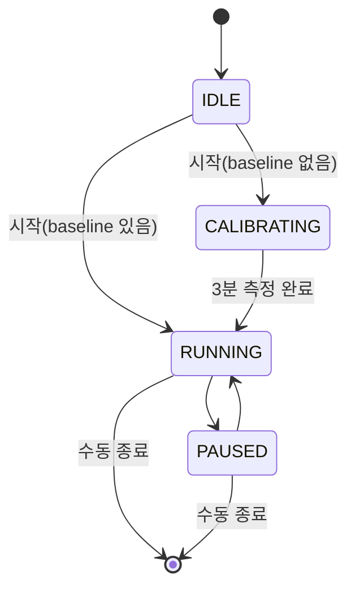
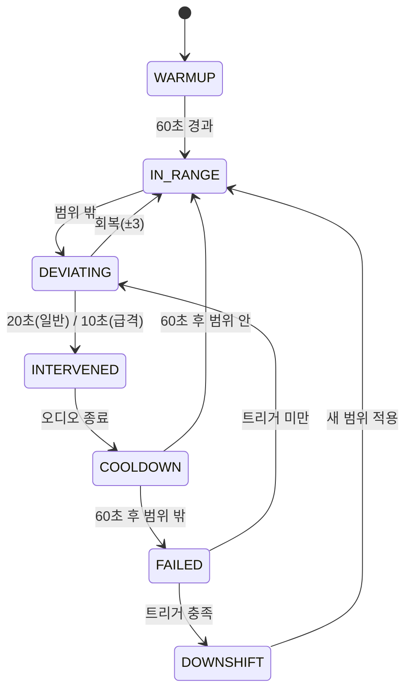

# ENGINE.md — 판정 룰 · 상태머신 · 수치표

**소유: 고은우 (Core FE)** · 구현: `app/src/engine/` (순수 TS, `react-native` import 금지)
이 문서의 숫자가 단일 진실. AI에 엔진 코드 요청 시 §1을 그대로 붙여넣을 것.

## 1. 수치표
| 항목 | 값 | 상수 |
| --- | --- | --- |
| 슬라이딩 윈도우 | 20초 | `WINDOW_SEC` |
| 계산 tick | 5초 | `TICK_SEC` |
| 센서 타이머 | 1초 | `SENSOR_TICK_SEC` |
| samples 저장 | 5초 | `SAMPLE_INTERVAL_SEC` |
| 워밍업 무개입 | 60초 | `WARMUP_SEC` |
| 정지 판정 제외 | < 100 spm | `IDLE_CADENCE_THRESHOLD` |
| 목표 범위 | 중심 ±4 | `TARGET_HALF_WIDTH` |
| 절대 클램프 | 145~180 | `CADENCE_CLAMP_MIN/MAX` |
| 컨디션 보정 | 가벼움 +2 / 보통 0 / 피곤함 −3 | `CONDITION_ADJUST` |
| 일반 이탈 | 범위 밖 20초 지속 | `DEVIATION_SEC` |
| 급격 이탈 | ±10 초과 밖 10초 지속 | `SEVERE_DEVIATION_SEC` / `SEVERE_THRESHOLD` |
| 회복 | 중심 ±3 진입 | `RECOVERY_HALF_WIDTH` |
| 쿨다운 | 60초 | `COOLDOWN_SEC` |
| 음성 | ≤3초, 1문장 | — |
| 메트로놈 | 5초 | `METRONOME_SEC` |
| Downshift(일반) | 실패 2회 | `DOWNSHIFT_FAIL_NORMAL` |
| Downshift(급격) | 실패 1회 | `DOWNSHIFT_FAIL_SEVERE` |
| Downshift(걷기) | 60초 지속 → 즉시 | `WALK_SEC` |
| 최대 하향 | 2회 | `MAX_DOWNSHIFT` |
| 하향 쿨타임 | 5분 | `DOWNSHIFT_INTERVAL_SEC` |
| 하향 하한 | `max(baseline−15, 140)` | `DOWNSHIFT_FLOOR` |
| 하향 후 안정화 | 새 범위 30초 유지 | `RESTABILIZE_SEC` |

`RECOVERY(±3) < TARGET(±4)` — 경계 깜빡임 방지 히스테리시스. 뒤집지 말 것.

## 2. Baseline
- 초기 추천: Rule-based (경험 수준 × 목표). **LLM 미사용.**
- 온보딩 수동 조절: ±5 spm 범위, 1 spm 단위.
- 확정: 첫 러닝 워밍업 후 3분 실측 중앙값.
- 2회차 이후: `users.baseline_cadence` 사용.
- 로직 반영 입력: 경험 수준·목표만. 신체 정보 제외.
- 러닝 중 수동 조절: 불가.

## 3. Target Range
```
center    = clamp(baseline + conditionAdjust, 145, 180)
targetMin = center - 4
targetMax = center + 4
```
클램프는 center에만 적용 (min/max 각각에 걸면 범위 폭이 찌그러짐).

## 4. 측정 사이클
```
1초 타이머 : 누적 걸음 차분 → 순간 SPM
20초 윈도우: 중앙값 → 판정용 cadence
5초 tick   : 판정 + samples push
```
- `watchStepCount` 콜백에서는 누적값만 갱신 (호출 빈도 불규칙).
- 워밍업 60초: tick은 돌되 판정 결과 무시, 샘플 저장은 진행.
- 윈도우 cadence < 100 → 정지 상태, 판정 제외 (걷기 판정과 별개).

## 5. 상태머신

### 세션 (`runStore`)

완주해도 자동 종료 없음(알림만). `PAUSED` 중 타이머·판정·샘플링 정지, `PAUSE`/`RESUME` 이벤트 기록.

### 판정 (`judge`)


## 6. 이탈 · 개입
- 급격 이탈(±10 초과, 10초)이 일반(±4, 20초)보다 먼저 발화.
- 개입 오디오: 음성 ≤3초 1문장 + 메트로놈 5초 (설정별 on/off).
- 쿨다운 60초: 무음 + 판정 보류.
- 재개입: 쿨다운 후 **반대 방향 이탈일 때만**. 같은 방향 지속은 실패 카운트 → downshift 경로.

| 상황 | `events[].type` | payload |
| --- | --- | --- |
| 시작 | `RUN_START` | `{min, max}` |
| 과속 개입 | `TOO_FAST` | `{cadence}` |
| 저속 개입 | `TOO_SLOW` | `{cadence}` |
| 안정 안내 | `STABLE` | `{cadence}` |
| 목표 하향 | `TARGET_ADJUSTED` | `{min, max, reason}` |
| 일시정지/재개 | `PAUSE`/`RESUME` | `{}` |
| 종료 | `RUN_END` | `{completed}` |

`reason`: `no_recovery` \| `severe` \| `walking`

## 7. Downshift
실패 = 쿨다운 60초 종료 시점에도 범위 밖.

| 트리거 | 조건 |
| --- | --- |
| 일반 이탈 | 실패 2회 |
| 급격 이탈 | 실패 1회 |
| 걷기 60초 지속 | 즉시 |

```
newCenter = median(직전 60초 실측 cadence)
newCenter = max(newCenter, max(baseline - 15, 140))
newMin/Max = newCenter ∓ 4
```
- 러닝당 2회, 하향 후 5분 금지, 새 범위 30초 유지 시 안정화.
- **원래 목표 복귀 없음.** 하향 범위가 최종 목표.
- 기록: `TARGET_ADJUSTED` 이벤트 + `runs.final_target_min/max` 갱신.

## 8. 완주 · 예외
| 상황 | 동작 |
| --- | --- |
| 목표 도달 | 알림만, 자동 종료 없음 |
| GPS 미수신 | 케이던스 로직 정상, `distance_m`·`avg_pace_sec_per_km` = null |
| 거리 목표 + GPS 미수신 | 시간 목표 전환 폴백 안내 |
| 백그라운드 | 무음 루프로 세션 유지, 판정 계속 |

## 9. 구현
- 센서: `Pedometer.watchStepCount()` 최우선.
- 오디오 세션: `MixWithOthers` + `staysActiveInBackground`. 외부 플레이리스트 중단 금지 (`DuckOthers`는 개입 순간만).
- 백그라운드 생존: 무음 루프 상시 재생 → `UIBackgroundModes: ["audio"]`.
- `CadenceSource` 인터페이스로 `PedometerSource` / `ReplaySource` 분리. **데모는 ReplaySource — 1일차에 구현.**
- `samples` push 5초 간격.

`engine/types.ts`에 들어갈 것 (UI FE 유일 접점): `RunState`, `JudgeVerdict`, `CadenceSample`, `RunEvent`, `TargetRange`, `CadenceSource`. 상수는 `engine/constants.ts`.

## 10. 서버 연산 (BE 소유)
러닝 중 판정 = 온디바이스 / 러닝 후 지표 = 서버.

| 지표 | 계산 |
| --- | --- |
| Rhythm Score | 목표 범위 유지 시간 / 전체 시간 (0~1) |
| Late Run Cadence Drop Rate | 후반 1/3 구간 케이던스 감소율 |
| Condition Score | 사용자 입력 (1~5) |
| **FI** | `(1−RhythmScore)×0.4 + LateDropRate×0.4 + (5−ConditionScore)/4×0.2` |

구현: `server/app/services/metrics.py`. 다음 목표 추천은 완주 여부·안정성·개입 횟수·후반 변화 기반, **AI 리포트 응답에 포함** (별도 API 없음).
