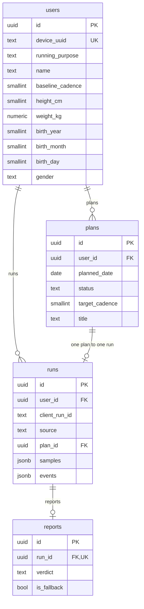

# 달리(Dalli) Database Schema & ERD

**Stack**: FastAPI + SQLAlchemy + PostgreSQL

## 1. ERD (Mermaid)



## 2. SQL DDL

### `users`

```sql
CREATE TABLE users (
    id                  UUID PRIMARY KEY DEFAULT gen_random_uuid(),
    device_uuid         TEXT NOT NULL UNIQUE,
    running_purpose     TEXT CHECK (running_purpose IN ('COMPLETE','HABIT','WEIGHT','FITNESS','PERFORMANCE')),
    experience_level    SMALLINT,        -- 0: Beginner, 1: Occasional, 2: Regular
    max_continuous_min  SMALLINT,
    weekly_goal_count   SMALLINT,
    baseline_cadence    SMALLINT,        -- Onboarding baseline (spm)
    name                TEXT,
    height_cm           SMALLINT,
    weight_kg           NUMERIC(4,1),
    birth_year          SMALLINT,
    birth_month         SMALLINT,
    birth_day           SMALLINT,
    gender              TEXT CHECK (gender IN ('M', 'F', 'O')),
    created_at          TIMESTAMPTZ NOT NULL DEFAULT now(),
    updated_at          TIMESTAMPTZ NOT NULL DEFAULT now()
);
```

### `runs`

```sql
CREATE TABLE runs (
    id                  UUID PRIMARY KEY DEFAULT gen_random_uuid(),
    user_id             UUID NOT NULL REFERENCES users(id) ON DELETE CASCADE,
    client_run_id       TEXT NOT NULL,                 -- Per-user idempotency key
    source              TEXT NOT NULL CHECK (source IN ('APP','MANUAL')),
    plan_id             UUID,                                -- FK는 plans 생성 후 추가

    started_at          TIMESTAMPTZ NOT NULL,
    ended_at            TIMESTAMPTZ,

    goal_type           TEXT CHECK (goal_type IN ('TIME','DISTANCE')),
    goal_value          INTEGER,                        -- sec or meter
    condition           SMALLINT CHECK (condition BETWEEN 1 AND 5),
                                        -- UI 3단계 매핑: 피곤함 1 / 보통 3 / 가벼움 5 (2·4 미사용)

    target_cadence_min  SMALLINT,
    target_cadence_max  SMALLINT,
    final_target_min    SMALLINT,                       -- Post-downshift target
    final_target_max    SMALLINT,

    duration_sec        INTEGER NOT NULL,
    active_duration_sec INTEGER NOT NULL,            -- duration minus pause intervals
    distance_m          INTEGER,
    avg_cadence         SMALLINT,
    avg_pace_sec_per_km INTEGER,
    completed           BOOLEAN NOT NULL DEFAULT false,

    rhythm_score        NUMERIC(4,3),
    late_drop_rate      NUMERIC(4,3),
    fatigue_index       NUMERIC(4,3),
    intervention_count  SMALLINT,
    downshift_count     SMALLINT,

    samples             JSONB,
    events              JSONB,

    memo                TEXT,
    created_at          TIMESTAMPTZ NOT NULL DEFAULT now()
);

CREATE INDEX idx_runs_user_started ON runs (user_id, started_at DESC);
CREATE UNIQUE INDEX uq_runs_user_client_run ON runs (user_id, client_run_id);
CREATE UNIQUE INDEX uq_runs_plan ON runs (plan_id) WHERE plan_id IS NOT NULL;
```

### `reports`

```sql
CREATE TABLE reports (
    id              UUID PRIMARY KEY DEFAULT gen_random_uuid(),
    run_id          UUID NOT NULL UNIQUE REFERENCES runs(id) ON DELETE CASCADE,
    verdict         TEXT NOT NULL,                   -- 한 줄 판정 (관찰)
    evidence        JSONB NOT NULL,                  -- 근거 수치 1~3개, string[]
    hypothesis      TEXT,                            -- 가능한 원인 (가설)
    prescription    TEXT,
    next_goal_text  TEXT NOT NULL,
    next_target_min SMALLINT NOT NULL,
    next_target_max SMALLINT NOT NULL,
    recovery_note   TEXT,                            -- 비의료성 회복 안내
    limitation      TEXT,                            -- 데이터 누락·품질 고지. 없으면 NULL
    is_fallback     BOOLEAN NOT NULL DEFAULT false,
    model           TEXT,
    created_at      TIMESTAMPTZ NOT NULL DEFAULT now()
);
```

AI 리포트 출력 필드는 `CONTRACT.md`의 `POST /runs/{run_id}/report` 절이 단일 진실이다.
여기에는 컬럼만 둔다. **`신뢰도`라는 이름은 쓰지 않는다 — 필드는 `limitation` 하나다.**

`evidence`는 짧은 문장 배열이라 정규화하지 않고 JSONB로 둔다.
폴백일 때는 `hypothesis`·`recovery_note`를 `NULL`로 남긴다 — 룰베이스로 가설을 지어내지 않는다.

### `plans`

```sql
CREATE TABLE plans (
    id            UUID PRIMARY KEY DEFAULT gen_random_uuid(),
    user_id       UUID NOT NULL REFERENCES users(id) ON DELETE CASCADE,
    planned_date  DATE NOT NULL,
    goal_type     TEXT CHECK (goal_type IN ('TIME','DISTANCE')),
    goal_value    INTEGER,
    target_cadence SMALLINT CHECK (target_cadence IS NULL OR target_cadence BETWEEN 130 AND 185),
    title         TEXT,
    memo          TEXT,
    status        TEXT NOT NULL DEFAULT 'PLANNED' CHECK (status IN ('PLANNED','DONE','SKIPPED')),
    created_at    TIMESTAMPTZ NOT NULL DEFAULT now(),
    updated_at    TIMESTAMPTZ NOT NULL DEFAULT now()
);

CREATE INDEX idx_plans_user_date ON plans (user_id, planned_date);
CREATE UNIQUE INDEX uq_plans_user_date ON plans (user_id, planned_date);

ALTER TABLE runs
    ADD CONSTRAINT fk_runs_plan
    FOREIGN KEY (plan_id) REFERENCES plans(id) ON DELETE SET NULL;
```

## 3. JSONB Structures

### `runs.samples`

Time-series data (5-second intervals).

```json
[
  { "t": 0, "c": 158, "p": 380, "d": 0 },
  { "t": 5, "c": 161, "p": 372, "d": 13.4 }
]
```

- `t`: Elapsed time (sec)
- `c`: Cadence (spm)
- `p`: Pace (sec/km, nullable)
- `d`: Cumulative distance (m)

### `runs.events`

```json
[
  { "t": 0, "type": "RUN_START", "payload": { "min": 153, "max": 161 } },
  { "t": 312, "type": "TOO_FAST", "payload": { "cadence": 171 } },
  { "t": 402, "type": "TARGET_ADJUSTED", "payload": { "min": 148, "max": 156, "reason": "no_recovery" } },
  { "t": 900, "type": "RECOVERY_MODE_ON", "payload": { "reason": "downshift_exhausted" } },
  { "t": 1230, "type": "RUN_END", "payload": { "completed": true } }
]
```

- `type` Enum: `RUN_START`, `TOO_FAST`, `TOO_SLOW`, `TARGET_ADJUSTED`, `RECOVERY_MODE_ON`, `PAUSE`, `RESUME`, `RUN_END`
- `TARGET_ADJUSTED.reason`: `no_recovery` | `severe` | `walking`
- `RECOVERY_MODE_ON.reason`: `downshift_exhausted` | `floor_reached`

> `STABLE`은 제거됨. Rhythm Score가 같은 정보를 담고, 러닝 중 긍정 피드백은 Silent-by-default와 충돌.
> 판정 룰과 상수는 `ENGINE.md`가 단일 진실.

## 4. SQLAlchemy Model Examples

```python
from sqlalchemy.dialects.postgresql import JSONB
from sqlalchemy.orm import Mapped, mapped_column
from pydantic import BaseModel

class Run(Base):
    __tablename__ = "runs"
    # ...other columns
    samples: Mapped[list[dict] | None] = mapped_column(JSONB)
    events:  Mapped[list[dict] | None] = mapped_column(JSONB)

class Sample(BaseModel):
    t: int
    c: int
    p: int | None = None
    d: float
```

## 5. `source`별 NULL 규칙

| 컬럼 | `APP` | `MANUAL` |
| --- | --- | --- |
| `duration_sec` | O | O |
| `started_at` | O | O (날짜) |
| `distance_m` | **nullable** (GPS 미수신 시 NULL) | 선택 |
| `condition` | O | 선택 |
| `memo` | 선택 | 선택 |
| `goal_type` / `goal_value` | O | **NULL** |
| `completed` | 판정 결과 | **`true` 고정** |
| `target_cadence_*` / `final_target_*` | O | **NULL** |
| `avg_cadence` | O | **NULL** |
| `avg_pace_sec_per_km` | **nullable** (GPS 미수신 시 NULL) | **NULL** |
| `rhythm_score` / `late_drop_rate` / `fatigue_index` | O | **NULL** |
| `intervention_count` / `downshift_count` | O | **NULL** |
| `samples` / `events` | O | **NULL** |
| AI 리포트 생성 | O | **안 함** |

**수기 기록에 `goal_type`/`goal_value`는 두지 않는다.** 이미 뛴 것을 사후에 남기는 기능이라
"목표"라는 개념이 성립하지 않는다. 따라서 완주 판정 기준도 없으므로 `completed`는 `true` 고정이며
이 값으로 아무 판단도 하지 않는다. 수기 기록 입력 화면에서도 목표를 묻지 않는다.

계획(`plans`)을 수기로 완료 처리하는 경우에도 목표를 복사하지 않는다. `plan_id`로 참조한다.

기획서의 핵심 구분: **수기 기록은 누적 활동일에는 반영되지만 `달리 데이`·AI 분석·목표 달성에는 반영하지 않는다.**
이 규칙은 서비스 레이어 한 곳(`is_analyzable(run)`)에 모으고 여기저기 흩지 않는다.

## 6. 서버 연산 지표

`rhythm_score` / `late_drop_rate` / `fatigue_index`의 **계산 정의는 `ENGINE.md` §12가 단일 진실**이다.
여기에는 컬럼 타입만 둔다. 두 곳에 적으면 반드시 어긋난다.

요약만: RS 분모는 `전체 − pause`(워밍업·정지 포함), LDR은 워밍업·정지 제외 후 3등분 중앙값,
FI는 각 항과 최종값 모두 `clamp(0,1)`, `condition` 미입력 시 기본값 3.
