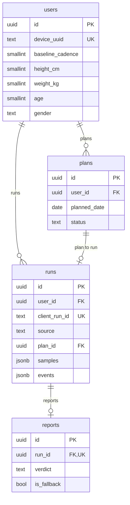

# 달리(Dalli) Database Schema & ERD

**Stack**: FastAPI + SQLAlchemy + PostgreSQL

## 1. ERD (Mermaid)



## 2. SQL DDL

### `users`

```sql
CREATE TABLE users (
    id                  UUID PRIMARY KEY DEFAULT gen_random_uuid(),
    device_uuid         TEXT NOT NULL UNIQUE,
    experience_level    SMALLINT,        -- 0: Beginner, 1: Occasional, 2: Regular
    max_continuous_min  SMALLINT,
    weekly_goal_count   SMALLINT,
    baseline_cadence    SMALLINT,        -- Onboarding baseline (spm)
    height_cm           SMALLINT,
	  weight_kg           NUMERIC(4,1),
    birth_year          SMALLINT,
    gender              TEXT CHECK (gender IN ('M', 'F', 'O')),
    created_at          TIMESTAMPTZ NOT NULL DEFAULT now(),
    updated_at          TIMESTAMPTZ NOT NULL DEFAULT now()
);
```

### `runs`

```sql
CREATE TABLE runs (
    id                  UUID PRIMARY KEY DEFAULT gen_random_uuid(),
    user_id             UUID NOT NULL REFERENCES users(id) ON DELETE CASCADE,
    client_run_id       TEXT NOT NULL UNIQUE,          -- Idempotency key
    source              TEXT NOT NULL CHECK (source IN ('APP','MANUAL')),
    plan_id             UUID REFERENCES plans(id) ON DELETE SET NULL,

    started_at          TIMESTAMPTZ NOT NULL,
    ended_at            TIMESTAMPTZ,

    goal_type           TEXT CHECK (goal_type IN ('TIME','DISTANCE')),
    goal_value          INTEGER,                        -- sec or meter
    condition           SMALLINT CHECK (condition BETWEEN 1 AND 5),

    target_cadence_min  SMALLINT,
    target_cadence_max  SMALLINT,
    final_target_min    SMALLINT,                       -- Post-downshift target
    final_target_max    SMALLINT,

    duration_sec        INTEGER NOT NULL,
    distance_m          INTEGER,
    avg_cadence         SMALLINT,
    avg_pace_sec_per_km INTEGER,
    completed           BOOLEAN NOT NULL DEFAULT false,

    rhythm_score        NUMERIC(4,3),
    late_drop_rate      NUMERIC(4,3),
    fatigue_index       NUMERIC(4,3),
    intervention_count  SMALLINT DEFAULT 0,
    downshift_count     SMALLINT DEFAULT 0,

    samples             JSONB,
    events              JSONB,

    memo                TEXT,
    created_at          TIMESTAMPTZ NOT NULL DEFAULT now()
);

CREATE INDEX idx_runs_user_started ON runs (user_id, started_at DESC);
```

### `reports`

```sql
CREATE TABLE reports (
    id              UUID PRIMARY KEY DEFAULT gen_random_uuid(),
    run_id          UUID NOT NULL UNIQUE REFERENCES runs(id) ON DELETE CASCADE,
    verdict         TEXT NOT NULL,
    hypothesis      TEXT,
    prescription    TEXT,
    next_goal_text  TEXT,
    next_target_min SMALLINT,
    next_target_max SMALLINT,
    is_fallback     BOOLEAN NOT NULL DEFAULT false,
    model           TEXT,
    created_at      TIMESTAMPTZ NOT NULL DEFAULT now()
);
```

### `plans`

```sql
CREATE TABLE plans (
    id            UUID PRIMARY KEY DEFAULT gen_random_uuid(),
    user_id       UUID NOT NULL REFERENCES users(id) ON DELETE CASCADE,
    planned_date  DATE NOT NULL,
    goal_type     TEXT CHECK (goal_type IN ('TIME','DISTANCE')),
    goal_value    INTEGER,
    memo          TEXT,
    status        TEXT NOT NULL DEFAULT 'PLANNED' CHECK (status IN ('PLANNED','DONE','SKIPPED')),
    created_at    TIMESTAMPTZ NOT NULL DEFAULT now(),
    updated_at    TIMESTAMPTZ NOT NULL DEFAULT now()
);

CREATE INDEX idx_plans_user_date ON plans (user_id, planned_date);
```

## 3. JSONB Structures

### `runs.samples`

Time-series data (5-second intervals).

```json
[
  { "t": 0, "c": 158, "p": 380, "d": 0 },
  { "t": 5, "c": 161, "p": 372, "d": 13.4 }
]
```

- `t`: Elapsed time (sec)
- `c`: Cadence (spm)
- `p`: Pace (sec/km, nullable)
- `d`: Cumulative distance (m)

### `runs.events`

```json
[
  { "t": 0, "type": "RUN_START", "payload": { "min": 154, "max": 160 } },
  { "t": 312, "type": "TOO_FAST", "payload": { "cadence": 171 } },
  { "t": 402, "type": "TARGET_ADJUSTED", "payload": { "min": 148, "max": 154, "reason": "no_recovery" } },
  { "t": 1230, "type": "RUN_END", "payload": { "completed": true } }
]
```

- `type` Enum: `RUN_START`, `TOO_FAST`, `TOO_SLOW`, `STABLE`, `TARGET_ADJUSTED`, `PAUSE`, `RESUME`, `RUN_END`

## 4. SQLAlchemy Model Examples

```python
from sqlalchemy.dialects.postgresql import JSONB
from sqlalchemy.orm import Mapped, mapped_column
from pydantic import BaseModel

class Run(Base):
    __tablename__ = "runs"
    # ...other columns
    samples: Mapped[list[dict] | None] = mapped_column(JSONB)
    events:  Mapped[list[dict] | None] = mapped_column(JSONB)

class Sample(BaseModel):
    t: int
    c: int
    p: int | None = None
    d: float
```